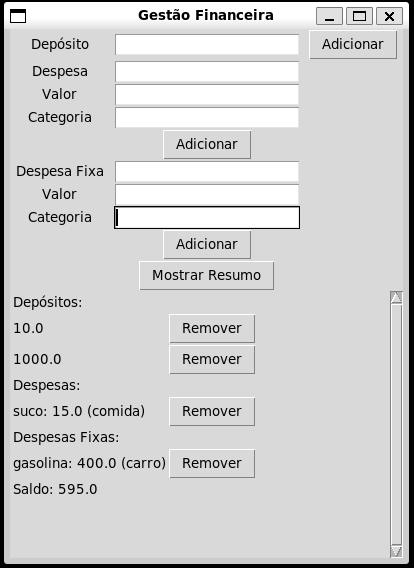

# Gestão Financeira com Tkinter

Este é um projeto de aplicação de gestão financeira usando a biblioteca Tkinter para interface gráfica. A aplicação permite a adição e remoção de depósitos, despesas e despesas fixas, além de mostrar um resumo financeiro com saldo atualizado.

## Funcionalidades

- Adicionar e remover depósitos.
- Adicionar e remover despesas.
- Adicionar e remover despesas fixas.
- Mostrar um resumo financeiro com saldo atualizado.
- Interface gráfica com barra de rolagem para visualizar muitos itens.

## Dependências

- Python 3.x
- Tkinter (geralmente incluído na instalação padrão do Python)
- Json (módulo padrão do Python)

## Instalação

1. Clone o repositório:

   ```sh
   git clone https://github.com/seu-usuario/gestao-financeira-tkinter.git
   ```

2. Navegue até o diretório do projeto:

   ```sh
   cd gestao-financeira-tkinter
   ```

3. Execute o programa:
   ```sh
   python main.py
   ```

## Estrutura do Projeto

- `main.py`: Arquivo principal que inicializa a aplicação.
- `gui.py`: Contém a definição da interface gráfica usando Tkinter.
- `financial_management.py`: Lógica de gestão financeira, incluindo persistência de dados.

## Como Usar

1. **Adicionar Depósito**: Insira o valor no campo "Depósito" e clique em "Adicionar".
2. **Adicionar Despesa**: Insira a descrição, valor e categoria da despesa nos campos correspondentes e clique em "Adicionar".
3. **Adicionar Despesa Fixa**: Insira a descrição, valor e categoria da despesa fixa nos campos correspondentes e clique em "Adicionar".
4. **Mostrar Resumo**: Clique no botão "Mostrar Resumo" para visualizar os depósitos, despesas, despesas fixas e o saldo atual.
5. **Remover Itens**: Clique no botão "Remover" ao lado do item que deseja remover na área de resumo.

## Capturas de Tela

### Tela Principal



## Contribuição

1. Fork o repositório.
2. Crie uma nova branch com sua feature: `git checkout -b minha-feature`.
3. Commit suas mudanças: `git commit -am 'Adicionei minha feature'`.
4. Push para a branch: `git push origin minha-feature`.
5. Envie um Pull Request.

## Contato

Nome: Julia de Santana
Email: falecomjuliasantana@gmail.com
LinkedIn: [LinkedIn](https://www.linkedin.com/in/julia-santana-040a12180/)
